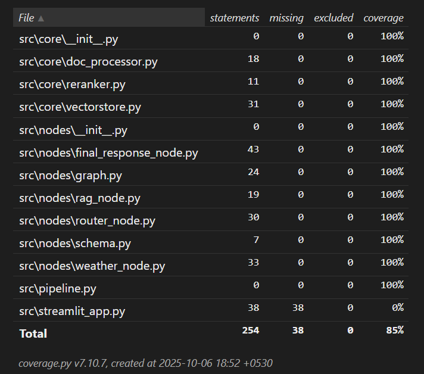
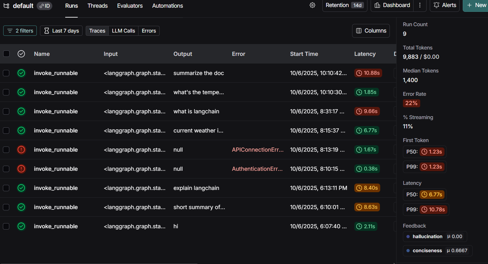
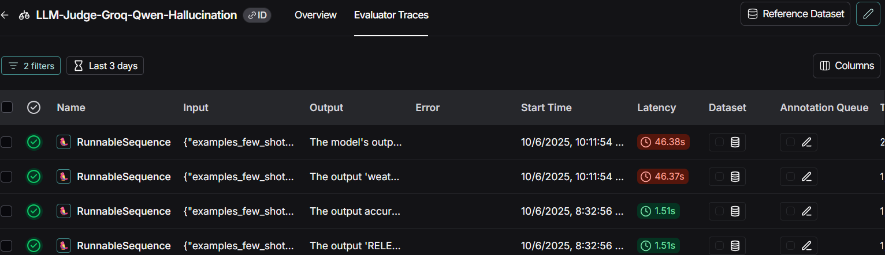
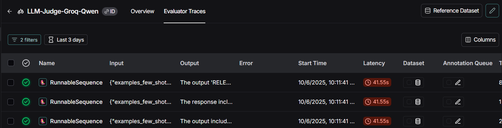

# Agentic RAG — PDF + Weather API

> A compact LangGraph agent that routes between **RAG** over ingested PDFs (Unstructured → Nomic embeddings → Qdrant → Cross‑Encoder reranker) and a **Weather API** (OpenWeatherMap). A router LLM decides which tool to call. Langsmith is used for tracing and as an LLM-as-judge for final verification.

---

## One‑line overview

Ingest PDFs → chunk → embed with Nomic → store in Qdrant. For each user query, a LangGraph router LLM decides `CALL_WEATHER` or `CALL_RAG`. RAG results are re‑ranked with `BAAI/bge-reranker-base` before generating the final answer. Use a Langsmith verifier to check hallucination and conciseness.

---

## Repo layout (concise)

```
repo-root/
├─ src/
│  ├─ core/                 # ingestion, vectorstore, reranker
│  │  ├─ doc_processor.py
│  │  ├─ vectorstore.py
│  │  └─ reranker.py
│  ├─ node/                 # langgraph nodes & graph
│  │  ├─ schema.py
│  │  ├─ weather_node.py
│  │  ├─ router_node.py
│  │  ├─ rag_node.py
│  │  ├─ final_response_node.py
│  │  └─ graph.py
│  └─ streamlit_app.py # runner
├─ examples/sample.pdf
├─ Dockerfile
├─ README.md
└─ .env.example
```

---

## Minimal configuration (.env)

```env
UNSTRUCTURED_API_KEY=your_unstructured_api_key
NOMIC_API_KEY=your_nomic_api_key
QDRANT_URL=https://your-hosted-qdrant.example.com
QDRANT_API_KEY=your_qdrant_api_key
OPENWEATHER_API_KEY=your_openweather_api_key
GROQ_API_KEY=your_groq_key
LANGSMITH_API_KEY=your_langsmith_key
LANGSMITH_TRACING=true_or_false
LANGSMITH_ENDPOINT=https://api.smith.langchain.com
```

> **Note:** Point `QDRANT_URL` to your hosted Qdrant instance and also set `QDRANT_API_KEY`.

---

## Minimal Quickstart (hosted Qdrant)

1. Create virtualenv & install deps:

```bash
python -m venv .venv
source .venv/bin/activate
pip install -r src/requirements.txt
```

2. Prepare `.env` from `.env.example` and fill keys.

3. Configure access to hosted Qdrant

* Set `QDRANT_URL` and `QDRANT_API_KEY` credentials in `.env`.
* Verify connectivity with a quick Python snippet:

```python
from qdrant_client import QdrantClient
import os

qdrant_url = os.environ['QDRANT_URL']
api_key = os.environ.get('QDRANT_API_KEY')
client = QdrantClient(url=qdrant_url, api_key=api_key)
print(client.get_collections())
```

If this returns collections (or an empty list), your connection is good.

4. Ingest a PDF (example script provided in `src/core/doc_processor.py`):

* Set your `UNSTRUCTERED_API_KEY` in `.env`
* ```chunk_and_save_doc.py``` has function which will:
    * parse the PDF using Unstructured,
    * chunk the text,
    * create embeddings using NomicEmbedding,
    * upsert vectors and metadata into your hosted Qdrant.

5. Run the LangGraph pipeline (router):

```bash
streamlit run src/streamlit_app.py
```

This starts the pipeline that accepts a user query and uses the router LLM to decide which tool to call.

---

## Walkthrough Video

https://github.com/user-attachments/assets/41af9ba9-7538-4a93-84cb-9acff29c64df

---

## Architecture (short)

```
User → LangGraph Router (LLM) → [Decision]
  ├─ CALL_WEATHER → weather_tool.fetch(city) → LLM to generate user friendly response
  └─ CALL_RAG → core.vectorstore.search → core.reranker.rerank → Relevance prediction LLM → RAG generator LLM
```

**Relevance prediction LLM:** an LLM checks for relevance of retrieved context w.r.t. user query and either approves the answer or returns a safe fallback like: *"I don't have enough context in the ingested documents to answer that."*

---

## How it works — brief module guide

* **core/doc_processor.py** — parse PDFs (Unstructured), split into chunks with configurable size/overlap, produce chunk metadata.
* **core/vectorstore.py** — Qdrant wrapper: create collections, schema, upsert, similarity search. Uses NomicEmbedding for vectorization.
* **core/reranker.py** — Cross‑encoder reranker wrapper (`BAAI/bge-reranker-base`) to re‑score candidates from Qdrant.
* **node/** — LangGraph nodes that wire core functionality into a graph-based pipeline (router_node decides route, rag_node runs retrieval+rerank, final_response_node runs verifier + generation).

---

## Unit Test Coverage

* There is a seperate `test` folder which has all unit-tests. 
> Note: You need to install pytest and pytest-cov using `pip install pytest pytest-cov`.



## Langsmith logs

* langsmith traces

    

* langsmith LLM-Judge (llm evaluators)
    - Hallucination Judge
    
    
    - Conciseness Judge
    
